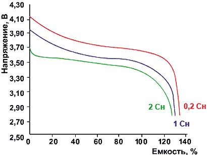
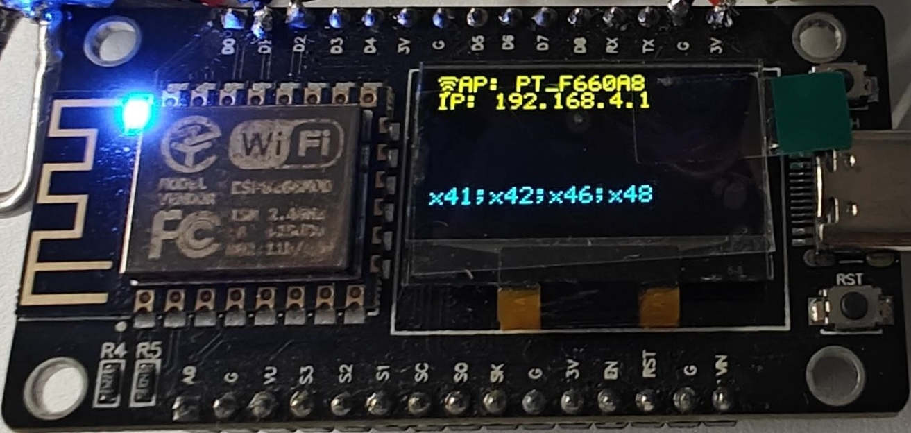
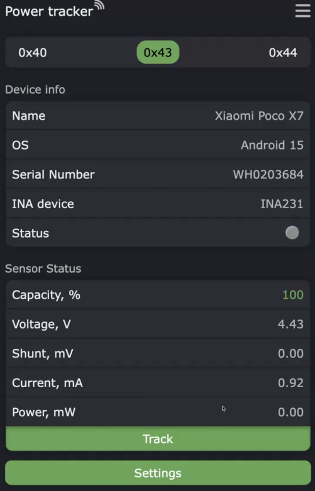

# Трекер энергопотребления на датчиках семейства INA (INA219, INA226, INA231) и ESP8266 с веб-интерфейсом

Базовая реализация — управляющий МК ESP8266 имеет на борту:
+ Wi-Fi (подключается или создаёт точку доступа),
+ 4 МБ флеш-памяти,
+ 80 КБ RAM,
+ 80/160 МГц частоты,
+ и клиент-серверные функции.

### Характеристики ESP8266

ESP8266 — это недорогой Wi-Fi-микроконтроллер, разработанный компанией Espressif Systems. Ниже приведены его ключевые характеристики в контексте данного проекта.

| Параметр | Значение |
| :--- | :--- |
| **Процессор** | Tensilica L106 32-bit RISC |
| **Тактовая частота** | 80 МГц (с возможностью повышения до 160 МГц) |
| **RAM** | 80 КБ (пользовательские данные) + 32 КБ (кэш инструкций) + 96 КБ (системная) |
| **Flash-память** | 4 МБ (в типовых модулях NodeMCU / Wemos D1 Mini) |
| **Wi-Fi** | 802.11 b/g/n, 2.4 ГГц, режимы Station (клиент) и SoftAP (точка доступа) |
| **GPIO** | до 11 цифровых выводов (из них 1 аналоговый вход ADC0, 0…1.0 В) |
| **Интерфейсы** | I2C, SPI, UART, I2S (программная реализация I2C через bit-bang) |
| **АЦП** | 10-бит, 1 канал (пин A0), диапазон 0…1.0 В |
| **Напряжение питания** | 2.5…3.6 В (рекомендуемое 3.3 В) |
| **Потребление** | ~80 мА в активном режиме, ~20 мкА в deep sleep |
| **Рабочая температура** | -40…+125 °C |

**Ограничения для проекта:**
- **Один аналоговый вход** — для измерения температуры через NTC-термистор потребуется мультиплексор или внешний АЦП.
- **Программный I2C** — аппаратного I2C-контроллера у ESP8266 нет, библиотеки реализуют его через bit-bang на любых GPIO. Это накладывает ограничение на скорость шины (обычно до 400 кГц) и длину линии.
- **Небольшой объём RAM (80 КБ)** — при подключении большого количества датчиков (более 8–10) или при активном использовании JSON-парсинга может потребоваться оптимизация.
- **Flash-память 4 МБ** — делится между прошивкой (~1.2 МБ), файловой системой LittleFS (~2.5 МБ) и OTA-образом (~1 МБ). При частых OTA-обновлениях может потребоваться увеличение размера flash-модуля.

Проект также поддерживает **ESP32** (см. раздел [Производительность и совместимость](#производительность-и-совместимость)), который снимает часть перечисленных ограничений.

Проект позволяет:
1. Измерять потребление энергии (тока и мощности) на любом потребителе с постоянным напряжением питания до *26-36 В* (в зависимости от используемого датчика тока: INA219, INA226, INA231) и измерять токи десятки А (при использовании подходящего токового шунта или нескольких шунтов в параллель). 
2. Подключать до *16* датчиков тока семейства *INAxxx* (проект поддерживает реализацию 3 типов датчиков INA219, INA226, INA231).
3. Вносить коэффициенты коррекции для измеряемого тока и напряжения (например, по эталонному вольтметру и амперметру).
4. Отслеживать состояние через OLED-дисплей *SSD1306* с разрешением 128×64.
5. Управлять процессом измерения через веб-интерфейс.
6. Управлять процессом измерения и получать промежуточные результаты через API.
7. Сохранять результаты измерений.
8. Производить параллельные измерения на нескольких датчиках тока независимо.
9. Обновляться "по воздуху" из репозитория при выходе новой версии прошивки. Это упрощает поддержку большого количества МК на ферме устройств для обновления до актуальной версии ПО.
10. Использовать датчики разного типа, подключенные к шине *2Wires (I2C)*.

## Критерии выбора датчика INAxxx
| Характеристика | INA219 | INA226 | INA228 | INA231 |
| :--- | :--- | :--- | :--- | :--- |
| **Основное назначение** | Монитор тока/мощности | Монитор тока/мощности | Монитор тока/мощности/энергии | Монитор тока/мощности |
| **Разрешение АЦП** | 12-бит | 16-бит | **20-бит** | 16-бит |
| **Диапазон напряжений (Common Mode)** | 0 … +26 В | 0 … +36 В | **-0.3 … +85 В** | 0 … +28 В |
| **Диапазон измерения шунта (±Vsense)** | ±40 / ±80 / ±160 / ±320 мВ (программно) | ±81.92 мВ | ±163.84 мВ / ±40.96 мВ | ±81.92 мВ |
| **Интерфейс связи** | I2C / SMBus | I2C / SMBus | **I2C / SMBus (High Speed)** | I2C / SMBus (1.8V совместимый) |
| **Макс. ток потребления** | 1 мА | 330 мкА | 640 мкА | 330 мкА (тип.) |
| **Ток в режиме сна** | 100 мкА | 2.5 мкА | 5 мкА | 100 мкА |
| **Входной ток смещения** | 10 мкА | 10 мкА | **2.5 нА (макс.)** | 10 мкА |
| **Напряжение питания (Vdd)** | 3.0 … 5.5 В | 2.7 … 5.5 В | 2.7 … 5.5 В | 2.7 … 5.5 В |
| **Встроенный датчик температуры** | Нет | Нет | **Да (±1°C точность)** | Нет |
| **Аккумуляция энергии/заряда** | Нет | Нет | **Да** | Нет |
| **Компенсация температуры шунта** | Нет | Нет | **Да** | Нет |
| **Кол-во адресов (I2C)** | 16 | 16 | 16 | 16 |
| **Alert (сигнальный пин)** | Нет | Да | **Да (быстрый отклик 75 мкс)** | Да |
| **Основные ошибки (макс)** | ±0.5% (по мощности) | ±0.5% (по мощности) | ±0.5% (по мощности), **±0.05%** (по усилению) | Gain: 0.5%, Offset: 50 мкВ |
| **Ошибка смещения (макс.)** | — | — | **±1 мкВ** | ±50 мкВ |
| **Температурный дрейф нуля** | 0.1 мкВ/°C | 0.02 мкВ/°C | **0.01 мкВ/°C** | 0.1 мкВ/°C |
| **Диапазон рабочих температур** | -40 … +125 °C | -40 … +125 °C | -40 … +125 °C | -40 … +125 °C |

## Среда и настройка
Для работы с кодом проекта и сборки используется VS Code c плагином [platformio](https://platformio.org)

## Схема и компоненты
Общение с INA и Oled дисплеем **SSD1306** реализовано с использованием шины I2C. Измерение тока и напряжения осуществляется через датчики: INA219, INA226, INA231.

## Что можно улучшить дальше?
1. Поддержка INA228: возможность измерять напряжение до 85 В, а также вести подсчёт энергопотребления (непрерывный режим измерения) внутри датчика.
2. Разработка proxy-шлейфов для подключения в разрыв между аккумулятором и телефоном/планшетом для упрощения интеграции: отказ от пайки и возможность подключаться к аккумулятора как с 1 ячейкой, так и с несколькими при параллельном подключении.
3. Управление питанием наблюдаемых устройств от внешнего источника питания вместо литиевого аккумулятора. Это позволит решить ряд проблем: пожаробезопасность, убирает необходимость слежения за уровнем заряда аккумулятора.
4. Измерение температуры термопарой NTC3950 через встроенный в МК АЦП. В ESP8266 только 1 аналоговый вывод, в ESP32 — несколько аналоговых выводов, которые можно использовать для подключения нескольких термопар.

## База

Измерение ёмкости батареи или энергопотребления сценария — это процесс количественной оценки общего заряда или энергии, которые потребляются из источника питания за время прогона. Основных единиц две: mAh/Ah и mWh/Wh, и каждая несёт свой физический смысл.

## Физика измерений

### Закон Ома

Основой всех измерений тока и напряжения является закон Ома:

$$
I = \frac{U}{R}
$$

где:
- $I$ — сила тока (А),
- $U$ — напряжение (В),
- $R$ — сопротивление (Ом).

В датчиках семейства INA ток измеряется косвенно: на токовом шунте известного сопротивления $R_{shunt}$ измеряется падение напряжения $U_{shunt}$, и ток вычисляется по закону Ома:

$$
I = \frac{U_{shunt}}{R_{shunt}}
$$

### Математическая модель измерительной цепи

Ниже приведена эквивалентная схема подключения датчика INA для измерения энергопотребления нагрузки:

```
    ┌──────────────────────────────────────────┐
    │              Источник питания             │
    │           (аккумулятор / БП)              │
    └────────────────────┬─────────────────────┘
                         │
                         │ I (ток цепи)
                         │
                    ┌────┴────┐
                    │ R_shunt │  ← токоизмерительный шунт (0.005 Ом)
                    │  (Ush)  │    на нём измеряется падение напряжения
                    └────┬────┘
                         │
                         │
                    ┌────┴────┐
                    │  IN+   │
                    │ ────── │  ← датчик INA (измеряет Ushunt и Uнагр)
                    │  IN-   │
                    └────┬────┘
                         │
                         │
                    ┌────┴────┐
                    │ R_нагр  │  ← нагрузка (телефон, планшет, ...)
                    │  (Uнагр)│
                    └────┬────┘
                         │
                         │
                    ┌────┴────┐
                    │   GND   │  ← общая земля
                    └─────────┘
```

**Математическая модель** описывается следующими соотношениями:

1. **Ток в цепи** — един для всей последовательной цепи (шунт + нагрузка):

   $$
   I = \frac{U_{shunt}}{R_{shunt}} = \frac{U_{нагр}}{R_{нагр}}
   $$

2. **Напряжение источника питания** равно сумме падений напряжений на шунте и нагрузке:

   $$
   U_{ист} = U_{shunt} + U_{нагр}
   $$

   Поскольку $R_{shunt} \ll R_{нагр}$ (шунт имеет сопротивление единицы-десятки мОм, а нагрузка — единицы-сотни Ом), падением напряжения на шунте можно пренебречь: $U_{shunt} \approx 0$, следовательно $U_{ист} \approx U_{нагр}$. Именно напряжение $U_{нагр}$ измеряет датчик INA между выводами GND и IN-.

3. **Мгновенная мощность**, потребляемая нагрузкой:

   $$
   P = U_{нагр} \times I
   $$

4. **Потреблённый заряд** (интеграл тока по времени):

   $$
   Q = \int_{t_0}^{t_1} I(t) \, dt \quad \text{[Кл]}
   $$

   $$
   Q_{mAh} = \frac{1000}{3600} \int_{t_0}^{t_1} I(t) \, dt \quad \text{[mAh]}
   $$

5. **Потреблённая энергия** (интеграл мощности по времени):

   $$
   E = \int_{t_0}^{t_1} U_{нагр}(t) \cdot I(t) \, dt \quad \text{[Дж]}
   $$

   $$
   E_{mWh} = \frac{1000}{3600} \int_{t_0}^{t_1} U_{нагр}(t) \cdot I(t) \, dt \quad \text{[mWh]}
   $$

Именно эти интегральные величины накапливает микроконтроллер в режиме Tracking, опрашивая датчик INA с заданным интервалом $\Delta t$ и выполняя дискретное суммирование.

### Электрический заряд и mAh

Электрический заряд $Q$ измеряется в кулонах (Кл). Один кулон — это заряд, переносимый током 1 А за 1 с:

$$
Q = I \times t
$$

где $t$ — время в секундах.

На практике для измерения ёмкости батарей удобнее использовать производную единицу **ампер-час (Ah)** и её дольную единицу **миллиампер-час (mAh)**:

$$
1 \text{ Ah} = 3600 \text{ Кл}
$$

$$
1 \text{ mAh} = 3.6 \text{ Кл}
$$

Поскольку ток в цепи непостоянен и меняется во времени, полный потреблённый заряд вычисляется как **интеграл тока по времени**:

$$
Q = \int_{t_0}^{t_1} I(t) \, dt
$$

В дискретном виде (для микроконтроллера с фиксированным интервалом опроса $\Delta t$):

$$
Q \approx \sum_{i=1}^{n} I_i \cdot \Delta t_i
$$

где $I_i$ — мгновенное значение тока на $i$-м измерении, $\Delta t_i$ — интервал времени между измерениями.

### Энергия и mWh

Энергия $E$ измеряется в джоулях (Дж). Мощность $P$ — это скорость потребления энергии:

$$
P = U \times I
$$

Потреблённая энергия — это интеграл мощности по времени:

$$
E = \int_{t_0}^{t_1} P(t) \, dt = \int_{t_0}^{t_1} U(t) \cdot I(t) \, dt
$$

В дискретном виде:

$$
E \approx \sum_{i=1}^{n} U_i \cdot I_i \cdot \Delta t_i
$$

На практике используется производная единица **ватт-час (Wh)** и её дольная единица **милливатт-час (mWh)**:

$$
1 \text{ Wh} = 3600 \text{ Дж}
$$

$$
1 \text{ mWh} = 3.6 \text{ Дж}
$$

### Связь mAh и mWh

Эти две величины связаны через напряжение:

$$
E = Q \times U
$$

или в производных единицах:

$$
\text{mWh} = \text{mAh} \times U
$$

где $U$ — среднее напряжение за время измерения.

Таким образом:
- **mAh** характеризует количество перенесённого заряда (сколько электронов перенесено).
- **mWh** характеризует количество потреблённой энергии (с учётом напряжения).

Для батарей с разным номинальным напряжением (например, 3.7 В Li-ion vs 1.2 В NiMH) сравнение по mAh некорректно — необходимо сравнивать по mWh.

### Аналогия с бытовым электросчётчиком

Принцип работы данного трекера полностью аналогичен бытовому электросчётчику, который установлен в квартире или доме. Такой счётчик измеряет потреблённую электроэнергию в *киловатт-часах (кВт·ч)*:

$$
1 \text{ кВт}\cdot\text{ч} = 1000 \text{ Вт}\cdot\text{ч} = 3\,600\,000 \text{ Дж}
$$

Электросчётчик работает по тому же принципу интеграла мощности по времени: он непрерывно измеряет мгновенное напряжение $U(t)$ и ток $I(t)$ в цепи, перемножает их (получая мгновенную мощность $P(t) = U(t) \cdot I(t)$) и суммирует эти значения за каждый период времени. По сути, счётчик выполняет ту же дискретную аппроксимацию интеграла:

$$
E \approx \sum_{i=1}^{n} U_i \cdot I_i \cdot \Delta t_i
$$

Разница лишь в масштабе:
- **Бытовой счётчик** оперирует киловаттами и киловатт-часами, измеряя энергопотребление за дни и месяцы.
- **Данный трекер** оперирует милливаттами и милливатт-часами, измеряя энергопотребление одного устройства (телефона, планшета) за время тестового прогона (минуты-часы).

Таким образом, проект представляет собой **прецизионный миниатюрный электросчётчик** для измерений энергопотребления мобильных и не только устройств.

### Напряжение источника питания

Номинальное напряжение Li-ion аккумулятора составляет 3,6–3,7 В. Это среднее значение напряжения на интервале от 4,2 В (полностью заряжен) до 3,0 В (полностью разряжен). Полная зарядка аккумулятора (100 %) означает, что напряжение на его клеммах достигло 4,2 В. При разряженном аккумуляторе (0 %) считается, что напряжение на батарее упало до 3,0 В (возможны значения до 2,5 В в зависимости от технологии производства, поколения и т.д.). Существуют высоковольтные Li-ion аккумуляторы с напряжением до **4,45 В**. Кривая разряда (зависимость напряжения от глубины разряда) нелинейна и может выглядеть следующим образом:



Не существует единой стандартизированной методики оценки процента потреблённого заряда батареи, поскольку под нагрузкой происходит просадка напряжения, а при меняющейся нагрузке напряжение будет просаживаться и восстанавливаться; положение напряжения в интервале от 4,2 до 3,0 В не даёт точной оценки. На практике между литиевой батареей и прибором устанавливается плата BMS (battery management system), которая выполняет следующие функции:
- **Защита от перезаряда** — отключение зарядного источника при достижении верхнего порогового напряжения (предотвращение пожара и взрыва).
- **Защита от переразряда** — при выходе за пределы нижнего порогового напряжения в литиевых батареях начинаются необратимые процессы, приводящие к потере ёмкости и росту внутреннего сопротивления, что снижает способность отдавать большие токи и повышает скорость саморазряда.
- **Защита от короткого замыкания** — отключение нагрузки при резком падении напряжения.

Функции подсчёта заряда (Coulomb counting), учёта циклов и определения степени износа (State of Health) реализуются отдельными микросхемами **fuel gauge** (например, BQ40Z50, MAX17048) или продвинутыми BMS с интегрированным fuel gauge. В простых платах защиты (DW01 + FS8205) эти возможности отсутствуют.

Существует два основных подхода к оценке процента заряда (State of Charge, SoC):
1. **По напряжению (voltage-based)** — простой метод, но неточный при переменной нагрузке из-за просадок и восстановлений напряжения.
2. **Кулонометрический (Coulomb counting)** — интегрирование тока по времени. В этом случае в fuel gauge хранится эталонная ёмкость полностью заряженной батареи в mAh/Ah и mWh/Wh, а текущий % заряда определяется как отношение оставшейся ёмкости к эталонной.

У каждого производителя свои алгоритмы расчёта SoC: некоторые устройства долго показывают 100 % при активном использовании или продолжают работать продолжительное время при индикации 0 %. Поэтому для качественной оценки энергопотребления различных сценариев необходимо измерять ёмкость в mAh/Ah и mWh/Wh, которые отдал источник питания во время прогона, исключая человеческий фактор. Желательно обеспечить одинаковые начальные условия теста, такие как температура измеряемого прибора (телефоны/планшеты при нагреве могут снижать частоты CPU и GPU для уменьшения тепловыделения). Также по известной только производителю логике при разряде аккумулятора могут включаться дополнительные ограничения на максимальные частоты CPU и GPU или режим энергосбережения. Из-за нелинейности кривой разряда для качественной оценки энергопотребления используется подсчёт потреблённого тока и мощности в mAh/Ah и mWh/Wh.

### mAh/Ah

Ток разряда (А) × Время разряда (ч) до конечного напряжения на интервале значений. Измеряется множество мгновенных значений тока, помноженных на дельту между двумя соседними измерениями. Результат — итоговая сумма. Например, 1000 mAh означает, что источник питания способен отдавать ток 1 А в течение 1 часа или ток 0,5 А в течение 2 часов и т.д.
Промежуточные «дельты» (мгновенные значения) не используются, так как в процессе измерения меняется нагрузка на источник питания и важна суммарная, итоговая потребленная энергия от источника питания за весь период прогона сценария.

### mWh/Wh

Среднее напряжение (В) × Суммарный заряд (Ач) — сумма мгновенных значений (Напряжение × Ток) за всё время разряда. Включает в себя напряжение, даёт прямое сравнение энергии между батареями с разными диапазонами напряжений разряда.

### Измерение тока и напряжения на датчиках серии INAxxx

На каждом датчике имеется 3 выходных провода: *земля* (подключается к '-' источника питания), **IN+** (подключается к '+' источника питания), **IN-** (подключается к '+' прибора). Токовый шунт (резистор), на котором происходит измерение напряжения, вставляется в разрыв цепи питания. Сопротивление шунта постоянно, и для его изготовления используется сплав, обеспечивающий стабильное значение сопротивления даже при изменении температуры шунта. По закону Ома (сила тока в цепи прямо пропорциональна напряжению и обратно пропорциональна сопротивлению: $I = U/R$) вычисляется ток цепи.
Между землей и **IN-** измеряется напряжение на приборе/источнике питания.

## Архитектура проекта

Проект построен на конечных автоматах (state machines). Основные компоненты:

- [`Context`](src/Context.h) — центральный контейнер зависимостей (DI). Содержит ссылки на все компоненты системы: WiFi, дисплей, БД, датчики, логгер и т.д.
- [`McStateMachine`](src/states/mc/McStateMachine.h) — конечный автомат микроконтроллера. Управляет состояниями самого МК (подключение к WiFi, ожидание, настройки, OTA).
- [`InaStateMachines`](src/states/ina/InaStateMachines.h) — менеджер конечных автоматов датчиков INA. Для каждого обнаруженного датчика создаётся свой экземпляр [`InaStateMachine`](src/states/ina/InaStateMachine.h).
- [`CommandsHandler`](src/net/CommandsHandler.h) — обработчик API-команд (start/stop/status/all).
- [`HttpRequestsHandler`](src/net/HttpRequestsHandler.h) — HTTP-обработчик, связывающий веб-сервер с командами.
- [`WebUi`](src/hack/WebUi.h) — веб-интерфейс на базе Gyver Settings.

### Структура директорий

```
src/
├── api/          # Абстрактные интерфейсы (Board, WifiAdapter, PowerMonitor, PixelDisplay, LedIndicator и др.)
├── db/           # Работа с базой данных (GyverDB), ключи конфигурации
├── devices/      # Реализации аппаратных компонентов
│   ├── circuit/  # Реализации датчиков INA (INA219, INA226, INA231) и детектор
│   └── ...
├── hack/         # Веб-интерфейс (WebUi)
├── net/          # Сетевые компоненты (HTTP, WiFi, команды)
├── ota/          # OTA-обновление (проверка, загрузка, установка)
├── res/          # Ресурсы: строки, заголовки UI
├── states/       # Конечные автоматы
│   ├── mc/       # Состояния МК (6 состояний)
│   └── ina/      # Состояния датчиков INA (2 состояния)
└── util/         # Утилиты: BuildInfo, Prefs, icons, Util
```

## Графы состояний

Подробное описание всех состояний, переходов и условий — в [docs/5/5.md](docs/5/5.md).

### Состояния микроконтроллера (МК)

МК реализован на [`McStateMachine`](src/states/mc/McStateMachine.cpp) и имеет 6 состояний, определённых в [`StateType`](src/states/mc/State.h:10):

```
[Старт (setup)]
     │
     ▼
┌─────────────────┐
│ ConnectingWifi  │◄────── потеря WiFi (колбэк onWifiDisconnected)
└────────┬────────┘
         │
    ┌────┴────┐
    ▼         ▼
┌────────┐ ┌──────────┐
│  Idle  │ │SetupWifi │ (если нет сохранённых SSID/пароля)
└───┬────┘ └──────────┘
    │
    │ кнопка "Settings"
    ▼
┌──────────┐
│ Settings │── Apply ──► Idle (или перезагрузка, если были изменения)
└──────────┘

┌───────────────┐
│ OtaUpdating   │ ←── из любого состояния при старте OTA
└───────────────┘
```

#### Описание состояний МК

| Состояние | Класс | Описание |
|-----------|-------|----------|
| `ConnectingWifi` | [`ConnectingWifiState`](src/states/mc/ConnectingWifiState.cpp) | Попытка подключиться к сохранённой WiFi-сети. При неудаче — создаёт собственную точку доступа. При отсутствии сохранённых учётных данных переходит в `SetupWifi`. |
| `Idle` | [`IdleState`](src/states/mc/IdleState.cpp) | Режим ожидания. Отображает данные с датчиков по вкладкам. Управляет LED-индикацией. Кнопка перехода в настройки. |
| `SetupWifi` | [`SetupWifiState`](src/states/mc/SetupWifiState.cpp) | Экран ввода SSID и пароля WiFi при первом включении. Есть кнопка "Skip" для перехода в Idle без WiFi. |
| `Settings` | [`SettingsState`](src/states/mc/SettingsState.cpp) | Настройки: WiFi, конфигурация платы (частота I2C), OTA-обновления, информация об устройстве, параметры датчиков (тип INA, шунт, коррекции, интервал опроса, стратегия питания). |
| `Warning` | [`WarningState`](src/states/mc/WarningState.cpp) | Зарезервировано. В текущей реализации — заглушка (пустые методы). |
| `OtaUpdating` | [`OtaUpdatingState`](src/states/mc/OtaUpdatingState.cpp) | Процесс OTA-обновления. Отображает прогресс на дисплее. |

### Состояния датчиков INA

Каждый датчик INA имеет собственный конечный автомат [`InaStateMachine`](src/states/ina/InaStateMachine.cpp) с 2 состояниями, определёнными в [`InaStateType`](src/states/ina/InaState.h:12):

```
[Старт] ──► Idle ──кнопка "Track" / API start──► Tracking
              ▲                                    │
              └────────кнопка "Stop" / API stop────┘
```

#### Описание состояний датчика INA

| Состояние | Класс | Описание |
|-----------|-------|----------|
| `Idle` | [`InaIdleState`](src/states/ina/InaIdleState.cpp) | Отображение мгновенных значений: напряжение (V), ток (mA), мощность (mW), напряжение на шунте (mV). Отображение статуса батареи (заряжается/разряжается/заряжена/разряжена) или источника питания. |
| `Tracking` | [`InaTrackingState`](src/states/ina/InaTrackingState.cpp) | Активное измерение с накоплением: totalCurrent (mAh), totalPower (mWh), maxCurrent, maxPower, minVoltage. При остановке результаты сохраняются в файл `/results_<addr>.json`. |

## Эксплуатация

### 1. Подготовка и первоначальная настройка

МК должен быть отключен от источника питания/USB-кабеля.
- Подключить все датчики тока к шине I2C. Для исключения ошибок при подключении используется колодка с разъемами *JST-XH-4S*.
- Подключить питание к МК через type C. МК также можно запитать через *V-IN* от внешнего источника питания с напряжением от 4,2 до 7 Вольт.
- После включения питания необходимо произвести первоначальную настройку. МК сам обнаружит ревизию платы, а также подключённые датчики тока. На экране будут выведены адреса обнаруженных датчиков в формате x*HH* (HH в диапазоне от 40 до 4F):



Также на экране выведены адреса найденных датчиков тока, а также создана точка доступа, к которой необходимо подключиться для дальнейшей настройки датчиков.

- [Первичное подключение](docs/1/1.1.md)
- [Смена сети](docs/1/1.2.md)
- [Настройка и калибровка датчиков](docs/1/1.3.md)

**Важно:** Нельзя подключать и отключать датчики тока при подключённом питании МК во избежание ошибок или повреждения электрической цепи МК/датчиков. Если необходимо подключить/отключить датчики:
1. обесточить МК,
2. провести все необходимые манипуляции с цепью МК.
3. после сборки подать питание на МК.

### 2. Режим ожидания



В режиме ожидания на каждый подключенный датчик есть своя вкладка, на которой отображается информация о подключенном устройстве, а так же мгновенные значения: 
- тока в **mAh/Ah**, 
- мощности в  **mWh/Wh**, 
- напряжения нагрузки в **V**,
- напряжения токоизмерительного шунта в **mV**

Индикатор статуса показывает подключение устройства. Идея в том, что минимальная активность телефона ведёт к току более 10 мА. Если активности нет — нет потребления тока. По PowerTracker можно также понять, включён телефон или нет.

### 3. Режим измерения


При управлении трекером через веб-интерфейс при остановке измерения результаты сохраняются в `/results_<addr>.json`, где `<addr>` — адрес датчика на шине I2C [0x40..0x4F]

Подробнее: [Режим измерения](docs/4/4.md)

### 4. API

Поддерживаются 4 метода:
- start - запуск замеров
```
curl -X GET "192.168.241.177/start?serial=WH0147641"

{
  "operation": "start",
  "serial": "WH0147641",
  "result": 1
}
```
- stop - остановка замеров и получение результата измерений в ответе. При использовании этого метода результаты в файл не сохраняются.
```
curl -X GET "192.168.241.177/stop?serial=WH0147641"

{
  "type": "Tracking 0x41",
  "stateType": 1,
  "totalTime": 2,
  "sensorAddress": 65,
  "totalCurrent": 0.01,
  "totalPower": 0.00,
  "maxCurrent": 0.98,
  "maxPower": 0.00,
  "minVoltage": 0.00,
  "result": 1,
  "operation": "stop",
  "serial": "SW0123456"
}
```
- status — получение текущего статуса. Необходимо обращать внимание на поле `status`. Если значение `Tracking` — в json будут присутствовать поля по измеренным величинам:
1. Израсходованный заряд в **mAh**,
2. Израсходованная энергия в **mWh**,
3. Минимальное (просадка) напряжение в **V**,
4. Пик тока в **mA**,
5. Пик мощности в **mW**,
6. Время измерения в **секундах**
```
curl -X GET "192.168.241.177/status?serial=WH0147641"

{
  "operation": "status",
  "serial": "WH0147641",
  "status": "Tracking",
  "totalTime": 6,
  "totalCurrent": 1.168755,
  "totalPower": 4.368473,
  "maxCurrent": 308.2275,
  "maxPower": 1098.633,
  "minVoltage": 3.9,
  "currentCurrent": 100.23,
  "currentVoltage": 4.01,
  "currentPower": 1000.79,
  "interval": 500,
}
```
- all - статусы всех датчиков

```
curl -X GET "192.168.241.177/all"

{
  "sensors": [
    {
      "address": 65,
      "serial": "SW0123456",
      "state": "idle"
    },
    {
      "address": 66,
      "serial": "SN_42",
      "state": "idle"
    },
    {
      "address": 70,
      "serial": "SN_46",
      "state": "idle"
    },
    {
      "address": 72,
      "serial": "SN_48",
      "state": "idle"
    }
  ]
}
```

## OTA (обновление по воздуху)

Проект поддерживает обновление прошивки "по воздуху" из удалённого репозитория.

### Механизм работы

1. МК периодически проверяет наличие новой версии, обращаясь по URL, указанному в настройках.
2. Сервер возвращает JSON-файл с информацией о версии (см. [`firmware_info.json`](firmware_info.json)).
3. МК сравнивает номер сборки (`buildNumber`) с текущим. Если номер выше — скачивает бинарник и устанавливает его.
4. Прогресс установки отображается на дисплее и в веб-интерфейсе.

### Структура firmware_info.json

```json
{
  "buildType": "release",
  "version": "1.0.0",
  "buildNumber": 2,
  "esp8266": "http://example.com/firmware.bin",
  "releaseNotes": "Bug fixes and improvements",
  "timestamp": "2025-12-25T20:00:00Z"
}
```

Поля:
- `buildType` — тип сборки (`release`, `beta`, `dev`)
- `version` — версия в формате SemVer
- `buildNumber` — номер сборки (инкрементальный, для сравнения)
- `esp8266` — прямая ссылка на бинарный файл прошивки
- `releaseNotes` — описание изменений
- `timestamp` — дата публикации

### Настройка OTA

Настройка производится в веб-интерфейсе, раздел **Updates**:
1. Указать URL репозитория с `firmware_info.json`
2. Выбрать интервал проверки (1ч, 6ч, 12ч, 24ч)
3. Включить автообновление

### Важно
- Если хотя бы на одном датчике идёт измерение — автообновление не произойдёт.
- Обновление возможно только при подключении к WiFi.

## LED-индикация

Светодиодный индикатор (встроенный LED на GPIO2) сигнализирует о состоянии МК:

| Режим | Состояние МК | Описание |
|-------|-------------|----------|
| Постоянно включён | `ConnectingWifi` (AP mode), `Settings` | МК в режиме настройки |
| Медленное мигание (500/1500 мс) | `Idle` (нет активных измерений) | Ожидание |
| Быстрое мигание (300/300 мс) | `Idle` (есть активные измерения) | Идёт трекинг на одном из датчиков |
| Выключен | `OtaUpdating`, `Idle` (onLeft) | Специфические состояния |

## Обнаружение платы (BoardDetector)

При старте МК автоматически определяет ревизию платы через [`BoardDetector`](src/devices/BoardDetector.cpp). 
Результат сохраняется в [`BoardConfig`](src/devices/BoardConfig.h) и используется для настройки пинов I2C и других параметров.

## Обнаружение датчиков INA (InaDetector)

При старте МК сканирует I2C-шину в диапазоне адресов 0x40–0x4F через [`InaDetector`](src/devices/circuit/InaDetector.cpp).
Для каждого найденного датчика:
1. Определяется тип (INA219, INA226, INA231) по регистрам.
2. Создаётся соответствующий объект-реализация ([`Ina219Impl`](src/devices/circuit/Ina219Impl.h), [`Ina226Impl`](src/devices/circuit/Ina226Impl.h), [`Ina231Impl`](src/devices/circuit/Ina231Impl.h)).
3. Создаётся конечный автомат [`InaStateMachine`](src/states/ina/InaStateMachine.cpp) для управления датчиком.

**Важно:** INA231 может определяться как INA226 из-за особенностей регистров разных ревизий. 
Необходимо вручную указать тип датчика в настройках.

## Стратегии питания (PowerStrategy)

Поддерживаются две стратегии питания, реализованные через интерфейс [`PowerStrategy`](src/api/PowerStrategy.h):

| Стратегия | Описание |
|-----------|----------|
| **Battery** | Режим батареи. Отображает процент заряда, статус (заряжается/разряжается/полностью заряжена/разряжена). Цветовая индикация: зелёный — заряжена, оранжевый — заряжается, красный — разряжается, серый — нет тока, чёрный — разряжена. |
| **PowerSource** | Режим источника питания. Зарезервирован для будущего использования. |

Настройка стратегии производится для каждого датчика индивидуально в разделе **Circuit params**.

## Конфигурация и база данных

Для хранения настроек используется GyverDBFile (`/data.db` на LittleFS).

### Основные ключи конфигурации

**Сетевые настройки** (`NET_CONFIG`):
- `wifi_ssid` — SSID точки доступа
- `wifi_pass` — пароль точки доступа

**Настройки платы** (`BOARD_CONFIG`):
- `i2c_frequency` — частота шины I2C (100 или 400 кГц)

**Информация об устройстве** (`DEVICE_INFO`, с привязкой к адресу датчика):
- `name` — название наблюдаемого прибора
- `os_info` — ОС прибора
- `serial_number` — серийный номер (инвентарный)
- `full_capacity` — полная ёмкость батареи (mAh)

**Параметры датчика** (`BAT_MONITOR_CONFIG`, с привязкой к адресу):
- `ina_device` — тип датчика (INA219/INA226/INA231)
- `shunt_resistance` — сопротивление шунта (Ом)
- `max_current` — максимальный измеряемый ток (А)
- `current_correction` — коэффициент коррекции тока
- `voltage_correction` — коэффициент коррекции напряжения
- `measurement_interval` — интервал опроса (мс, по умолчанию 500)
- `power_strategy` — стратегия питания (Battery/PowerSource)

**Параметры стратегии питания** (`POWER_STRATEGY_CONFIG`, с привязкой к адресу):
- `battery_min_voltage` — минимальное напряжение батареи (В)
- `battery_max_voltage` — максимальное напряжение батареи (В)
- `power_source_min_voltage` — минимальное напряжение источника питания (В)
- `power_source_max_voltage` — максимальное напряжение источника питания (В)

**OTA-настройки** (`OTA_CONFIG`):
- `server_url` — URL репозитория с обновлениями
- `url_params` — дополнительные параметры URL
- `auto_update_enabled` — флаг автообновления
- `check_interval` — интервал проверки обновлений (индекс: 0=вручную, 1=1ч, 2=6ч, 3=12ч, 4=24ч)

## Сборка и прошивка

### Требования
- VS Code с плагином [PlatformIO](https://platformio.org)
- Поддерживаемые платформы: ESP8266, ESP32

### Конфигурация платформы
Файл [`platformio.ini`](platformio.ini) содержит конфигурации для разных плат.
Файлы [`partitions_esp8266.csv`](partitions_esp8266.csv) и [`partitions_esp32.csv`](partitions_esp32.csv) — таблицы разделов для соответствующих платформ.

### Скрипты
- [`generate_buildinfo.py`](scripts/generate_buildinfo.py) — генерация информации о сборке
- [`flash_firmware.py`](flash_firmware.py) — скрипт для прошивки
- [`size_report.py`](size_report.py) — отчёт о размере прошивки

### Процесс сборки
1. Открыть проект в VS Code
2. Выбрать нужную платформу в PlatformIO
3. Собрать проект (Build)
4. Прошить на МК (Upload)

## Файловая система (LittleFS)

На МК используется файловая система LittleFS со следующей структурой:

| Файл | Назначение |
|------|-----------|
| `/data.db` | База данных настроек (GyverDB) |
| `/results_<addr>.json` | Результаты измерений для датчика с адресом `<addr>` (например, `results_41.json`) |

## Веб-интерфейс (Web UI)

Веб-интерфейс построен на форке библиотеки Gyver Settings.

### Основные разделы
- **Главная** — отображение данных с датчиков, кнопки управления
- **Настройки** — конфигурация WiFi, платы, OTA, датчиков
- **Гамбургер-меню**:
  - Настройка темы (светлая/тёмная)
  - Файловый менеджер (просмотр файловой системы МК, загрузка/скачивание файлов)
  - Загрузка бинарника прошивки для ручного обновления

## Особенности
- К одному МК можно подключить до 16 датчиков тока по I2C
- Для управления через веб-интерфейс необходимо, чтобы веб-интерфейс был открыт только у одного клиента. Если будет подключено 2 и более клиента, то при старте измерения подтверждающий диалог может быть показан другому клиенту — не тому, кто запускает измерения. Ошибка в библиотеке Gyver Settings.

## Известные проблемы и ограничения
1. **WarningState** — состояние предупреждения не реализовано (заглушка).
2. **Температурный датчик** — в коде присутствует `TemperatureMeterImpl`, но он закомментирован (`nullptr` в `initContext`).
3. **Gyver Settings** — ошибка с множественными клиентами: подтверждение старта может быть показано не тому клиенту.
4. **INA231** — может определяться как INA226 из-за особенностей регистров разных ревизий.
5. **PowerSource** — стратегия питания "источник питания" не реализована до конца (пустые методы `drawPowerSource` и `updatePowerSource`).

## Используемые библиотеки
- Gyver INA
- Gyver Oled
- форк Gyver Settings
- ArduinoJson
- ESPAsyncWebServer-esphome

## Быстрый старт

### Что понадобится

1. **Аппаратное обеспечение:**
   - Микроконтроллер ESP8266 (NodeMCU, Wemos D1 Mini) или ESP32
   - Один или несколько датчиков INA219/INA226/INA231
   - Токоизмерительный шунт (резистор) — если не встроен в датчик
   - OLED-дисплей SSD1306 128×64 (I2C)
   - Источник питания 4.2–7 В (аккумулятор или БП)
   - Соединительные провода, колодка JST-XH-4S (опционально)

2. **Программное обеспечение:**
   - VS Code с плагином [PlatformIO](https://platformio.org)
   - Python 3.8+ (для скриптов сборки)

### Пошаговая инструкция

1. **Сборка схемы:**
   - Подключить датчики INA к шине I2C (SDA → D2, SCL → D1 для ESP8266)
   - Подключить OLED-дисплей SSD1306 к той же шине I2C (или использовать платы с распаянным дисплеем aka HW364A)
   - Заменить токовый шунт на подходящий с учетом максимально возможного тока
   - Подключить питание к МК (USB или V-IN)

2. **Прошивка:**
   ```bash
   # Клонировать репозиторий
   # Открыть в VS Code, выбрать платформу в PlatformIO
   # Собрать и прошить
   ```

3. **Первое включение:**
   - После подачи питания МК создаст точку доступа `PT_XXXXXX`
   - Подключиться к ней (пароль: `power_tracker`)
   - Открыть веб-интерфейс по адресу `192.168.4.1`
   - Ввести SSID и пароль вашей WiFi-сети
   - МК перезагрузится и подключится к вашей сети

4. **Настройка датчиков:**
   - В веб-интерфейсе перейти в **Settings → Circuit params**
   - Для каждого датчика указать: тип INA, сопротивление шунта, макс. ток
   - При необходимости откалибровать по эталонному вольтметру/амперметру и задать коэффициенты коррекции по току и напряжению

5. **Запуск измерения:**
   - На главной странице нажмите **Track** на вкладке нужного датчика
   - Для остановки нажмите **Stop** — результаты сохранятся в файл

## Примеры использования

### Измерение энергопотребления телефона за час

```bash
# 1. Подключить телефон к трекеру через USB
# 2. Запустить измерение через API
curl -X GET "http://tracker-ip/start?serial=PHONE001"

# 3. Использовать телефон в течение часа (серфинг, видео, игры)
# 4. Остановить измерение
curl -X GET "http://tracker-ip/stop?serial=PHONE001"

# 5. Получить результат:
#    totalCurrent — сколько mAh потреблено
#    totalPower   — сколько mWh потреблено
#    maxCurrent   — пиковый ток
#    minVoltage   — просадка напряжения
```

### Сравнение двух прошивок

```bash
# Измерение с прошивкой A
curl -X GET "http://tracker-ip/start?serial=FW_A"
# ... ждём 30 минут ...
curl -X GET "http://tracker-ip/stop?serial=FW_A"

# Измерение с прошивкой B
curl -X GET "http://tracker-ip/start?serial=FW_B"
# ... ждём 30 минут ...
curl -X GET "http://tracker-ip/stop?serial=FW_B"

# Сравнить totalPower — какая прошивка энергоэффективнее
```

### Автоматизация тестового прогона

```bash
#!/bin/bash
# run_test.sh — запуск измерения на 1 час с последующим сбором результатов

TRACKER_IP="192.168.1.100"
SERIAL="TEST_$(date +%Y%m%d_%H%M)"

# Запуск
curl -s -X GET "http://${TRACKER_IP}/start?serial=${SERIAL}"

# Ожидание 1 час
sleep 3600

# Остановка и сохранение результата
curl -s -X GET "http://${TRACKER_IP}/stop?serial=${SERIAL}" > "result_${SERIAL}.json"

echo "Результат сохранён в result_${SERIAL}.json"
```

## Развёртывание инфраструктуры

### Настройка OTA-сервера

Для автоматического обновления прошивки по воздуху необходим HTTP-сервер, раздающий файлы:

```bash
# Простейший вариант — Python HTTP-сервер
mkdir -p /var/www/ota
cp firmware.bin /var/www/ota/
cat > /var/www/ota/firmware_info.json << EOF
{
  "buildType": "release",
  "version": "1.0.1",
  "buildNumber": 3,
  "esp8266": "http://your-server:8090/firmware.bin",
  "releaseNotes": "Bug fixes and performance improvements",
  "timestamp": "$(date -u +%Y-%m-%dT%H:%M:%SZ)"
}
EOF

# Запуск сервера
cd /var/www/ota && python3 -m http.server 8090
```

В настройках МК (раздел **Updates**) укажите URL: `http://your-server:8090/firmware_info.json`

### Организация фермы устройств

При большом количестве трекеров рекомендуется:

1. **Фиксированные IP-адреса** — назначить каждому МК статический IP в DHCP
2. **Единый OTA-сервер** — все МК проверяют обновления на одном сервере
3. **Сбор результатов** — настроить скрипт для периодического сбора файлов с МК через API `/all` и `/status`
4. **Мониторинг** — проверять доступность каждого трекера по API `/all`

```bash
# Пример скрипта сбора данных со всех трекеров
for ip in 192.168.1.101 192.168.1.102 192.168.1.103; do
  curl -s "http://${ip}/all" > "tracker_${ip}_$(date +%Y%m%d).json"
done
```

## Безопасность

### Защита веб-интерфейса

- Веб-интерфейс не имеет встроенной аутентификации. Рекомендуется:
  - Использовать изолированную сеть (без доступа в интернет)
  - Настроить файрвол на роутере для ограничения доступа к МК
  - При необходимости — настроить reverse proxy с базовой аутентификацией

### Защита OTA-обновлений

- OTA-сервер должен быть доступен только из доверенной сети
- Рекомендуется использовать HTTPS для защиты от подмены прошивки
- Проверять целостность бинарника через контрольную сумму

### Хранение учётных данных

- WiFi-пароль хранится в `/data.db` на LittleFS в открытом виде
- При физическом доступе к МК данные можно извлечь
- Не использовать критически важные пароли от инфраструктуры

## Поиск и устранение неисправностей (Troubleshooting)

| Проблема | Вероятная причина | Решение |
|----------|------------------|---------|
| МК не создаёт точку доступа | Ошибка питания | Проверить питание (4.2–7 В на V-IN) |
| Датчики INA не обнаружены | Неправильное подключение I2C | Проверить SDA/SCL, подтяжку 4.7 кОм |
| Неверные показания тока | Неправильный шунт или калибровка | Проверить сопротивление шунта в настройках |
| OTA-обновление не запускается | Нет подключения к WiFi | Проверить настройки WiFi |
| OTA-обновление не запускается | Идёт измерение | Остановить все измерения |
| Дисплей не работает | Неправильный адрес I2C | Проверить адрес SSD1306 (0x3C или 0x3D) |
| МК перезагружается в цикле | Недостаточно питания | Использовать БП 5В 2А |
| INA231 определяется как INA226 | Особенность ревизий | Вручную указать тип в настройках |

## Тестирование

### Юнит-тесты

Проект поддерживает сборку с тестами для платформы `native` (запуск на ПК):

```bash
# Собрать и запустить тесты
pio test -e native
```

### Интеграционные тесты

Для проверки работы с реальным железом:

1. Подключить МК с датчиками
2. Запустить тестовый сценарий:
   ```bash
   # Проверка API
   curl -s "http://tracker-ip/all" | grep -q "sensors" && echo "API OK"
   
   # Проверка старта/стопа
   curl -s -X GET "http://tracker-ip/start?serial=TEST"
   sleep 5
   curl -s -X GET "http://tracker-ip/stop?serial=TEST" | grep -q "totalCurrent" && echo "Tracking OK"
   ```

### Проверка новой прошивки

Перед массовым обновлением через OTA:

1. Прошить один тестовый МК вручную
2. Запустить измерение на 10 минут
3. Проверить, что все API-методы работают
4. Проверить OTA-обновление с тестового сервера
5. Только после этого публиковать прошивку на продуктивный OTA-сервер

## Производительность

| Параметр | Значение |
|----------|----------|
| Максимальное количество датчиков | 16 (по числу I2C-адресов 0x40–0x4F) |
| Минимальный интервал опроса | 100 мс (зависит от частоты I2C) |
| Рекомендуемый интервал опроса | 500 мс (по умолчанию) |
| Частота I2C | 100 кГц (по умолчанию) / 400 кГц (рекомендуется) |
| Влияние частоты I2C на точность | Не влияет, влияет только на скорость опроса |
| Потеря данных при переполнении | Нет, данные накапливаются в RAM и сохраняются при остановке |

## Совместимость

### Платформы

| Платформа | Статус | Особенности |
|-----------|--------|-------------|
| ESP8266 | ✅ Полная поддержка | 80 МГц, 80 КБ RAM, 4 МБ flash |
| ESP32 | ✅ Поддерживается | 240 МГц, больше RAM, второй I2C, больше аналоговых входов |

### Датчики

| Датчик | Статус | Примечание |
|--------|--------|------------|
| INA219 | ✅ Поддерживается | 12-бит АЦП, до 26 В |
| INA226 | ✅ Поддерживается | 16-бит АЦП, до 36 В |
| INA231 | ✅ Поддерживается | Может определяться как INA226 |
| INA228 | ❌ Не поддерживается | В планах |

### Дисплеи

| Дисплей | Статус |
|---------|--------|
| SSD1306 128×64 (I2C) | ✅ Поддерживается |

## Вклад в проект (Contributing)

Мы приветствуем вклад в развитие проекта!

### Как помочь

1. **Сообщить об ошибке** — создайте Issue с описанием проблемы, шагами воспроизведения и версией прошивки
2. **Предложить улучшение** — создайте Issue с меткой `enhancement`
3. **Отправить Pull Request**:
   - Форкнуть репозиторий
   - Создать ветку для ваших изменений
   - Убедиться, что код собирается (`pio build`)
   - Убедиться, что тесты проходят (`pio test -e native`)
   - Открыть Pull Request с описанием изменений

### Стиль кода

- Имена классов — PascalCase
- Имена методов и переменных — camelCase
- Имена констант — UPPER_SNAKE_CASE
- Файлы заголовков — `.h`, реализации — `.cpp`
- Документировать публичные методы в заголовочных файлах

### Настройка окружения для разработки

```bash
# Клонировать форк
git clone https://github.com/VK-QLab/power-tracker
cd power-tracker

# Установить зависимости PlatformIO
pio update

# Собрать для всех платформ
pio run

# Запустить тесты
pio test -e native
```

## Лицензия

Проект распространяется под лицензией [`MIT License`](LICENSE).
