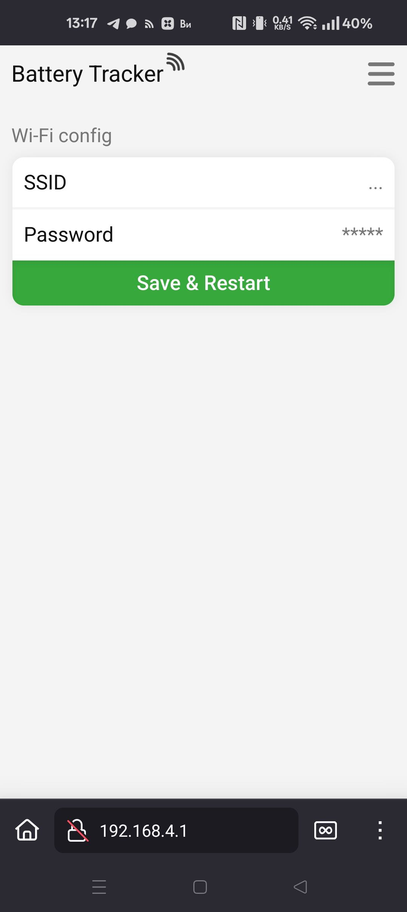

# Первичная настройка Wi-Fi

При первом включении МК создаёт точку доступа `PT_XXXXXX` (XXXXXX — последние 6 символов MAC-адреса). Пароль: `power_tracker`.

1. Подключиться к `PT_XXXXXX`
2. Открыть `192.168.4.1`
3. Ввести SSID и пароль сети, сохранить

МК перезагрузится и подключится к сети. При неверных учётных данных — перейдёт в Idle, точка доступа `PT_XXXXXX` останется активной.
