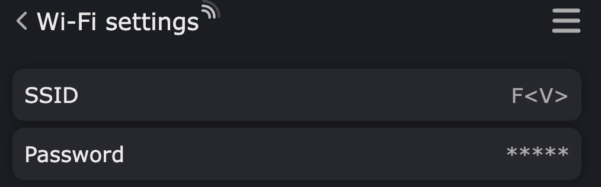
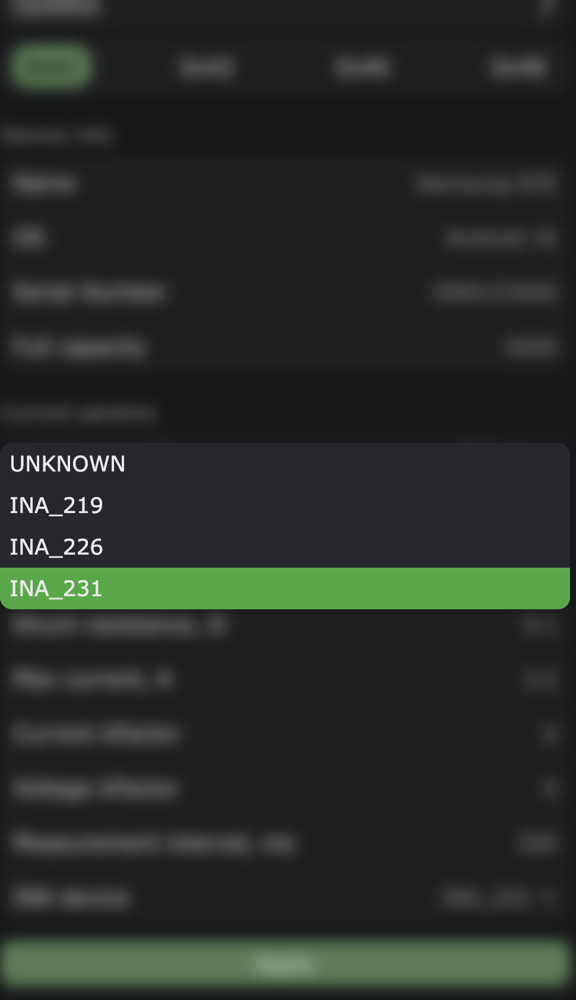
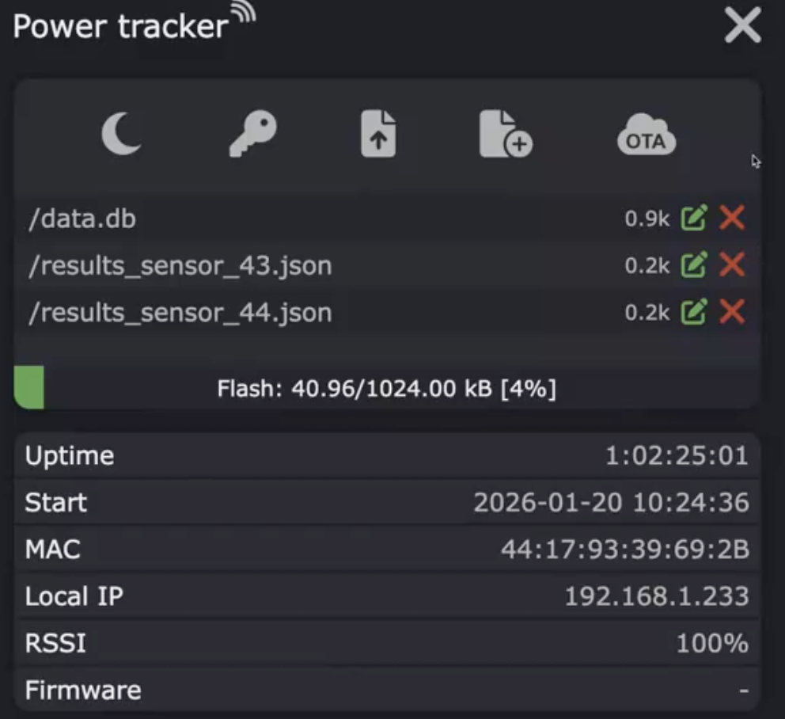

# Настройка и калибровка датчиков

Открыть настройки. Количество вкладок соответствует количеству обнаруженных датчиков при включении МК.

## Wi-Fi settings



Можно сменить подключение к сети: SSID и пароль. ESP8266 поддерживает только 2,4 ГГц. МК перезагрузится и переподключится к другой сети.

## Board config

Для повышения скорости получения результатов по шине I2C рекомендуется выставить частоту шины — 400 кГц. Значение по умолчанию — 100 кГц. При изменении параметров платы МК произойдёт перезагрузка.

## Updates

Можно включить автообновление МК "по воздуху".
1. Необходимо указать URL репозитория, где лежат файлы: json с информацией об обновлении, с такой структурой:

```
{
  "buildType": "release",
  "version": "1.0.0",
  "buildNumber": 2,
  "esp8266": "http://10.12.250.90:8090/firmware.bin",
  "releaseNotes": "Bug fixes and improvements",
  "timestamp": "2025-12-25T20:00:00Z"
}
```
и ссылка с абсолютным путем на файл бинарника прошивки, на который ссылается поле "esp8266" в json.
2. Необходимо выбрать интервал проверки.
3. Включить автообновление.

МК проверяет номер сборки, и если в репозитории номер сборки выше — МК скачает бинарник и выполнит прошивку.
Прогресс обновления будет показан на дисплее МК. 
**Важно:** Если хотя бы на одном из датчиков идёт измерение потребления тока — автообновление не произойдёт.

## Device info

В этой секции необходимо настроить информацию о наблюдаемом приборе для удобства:
- название,
- серийный номер (наклейка с инвентарным номером)
- ОС
- полную емкость батареи (при питании от батареи)

## Curcuit params

1. В секции **Circuit params** выбрать используемый тип датчика: *INA219*, *INA226*, *INA231*



При подключении **INA231** датчик может определяться как **INA226**. Причина в том, что датчики серии *INA231* встречаются разных ревизий с разным набором конфигурационных регистров, и по набору регистров они могут быть неотличимы от INA226. Необходимо каждому датчику, подключённому к МК, задать свой тип для корректности измерений.

2. В секции: **Curcuit params** так же можно внести коэффициенты коррекции в измерение тока и напряжения для калибровки по эталонному вольтметру и амперметру.
3. Указать максимальное значение измеряемого тока. 
4. Указать сопротивление токового шунта. Для измерений токов до **10 А** значение токового шунта подобрано **0.005 Ом** или **5 мОм**.
5. Интервал опроса датчика по-умолчанию 500 мс.
6. **Power Strategy** — способ питания: батарея или источник питания. Стратегия «источник питания» пока является заглушкой.

## Применение изменений

Применить изменения. При необходимости - МК перезагрузится.

## Гамбургер



Меню:
- настроить тему: светлую, темную
- посмотреть файловую систему МК
- загрузить файл на МК
- скачать файл с МК
- загрузить бинарник на МК для обновления

