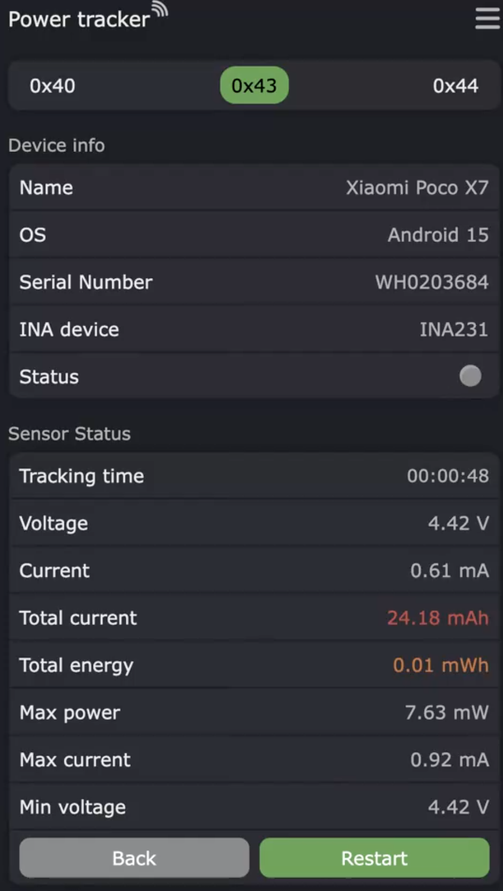

# Режим измерения (Tracking)

## Описание

Режим измерения (Tracking) — это основной рабочий режим датчика INA, в котором происходит накопление данных о потреблённой энергии.

## Запуск измерения

Измерение можно запустить двумя способами:

### 1. Через веб-интерфейс
- На главной странице веб-интерфейса нажать кнопку **Track** на вкладке нужного датчика.
- Появится диалог подтверждения.
- После подтверждения начнётся измерение.

### 2. Через API
```bash
curl -X GET "192.168.241.177/start?serial=WH0147641"
```

## Процесс измерения

Во время измерения датчик находится в состоянии [`InaStateType::Tracking`](../../src/states/ina/InaState.h:14).

### Измеряемые величины

| Величина | Единица | Описание |
|----------|---------|----------|
| `currentCurrent` | mA | Текущий ток |
| `currentVoltage` | V | Текущее напряжение |
| `currentPower` | mW | Текущая мощность |
| `totalCurrent` | mAh | Накопленный ток (интеграл тока по времени) |
| `totalPower` | mWh | Накопленная энергия (интеграл мощности по времени) |
| `maxCurrent` | mA | Пиковый ток за время измерения |
| `maxPower` | mW | Пиковая мощность за время измерения |
| `minVoltage` | V | Минимальное напряжение (просадка) за время измерения |
| `totalTime` | сек | Время измерения |

### Расчёт накопленных значений

Накопление происходит с каждым циклом опроса датчика:

```
elapsedHours = elapsedTime / 3600000          // мс → часы
totalCurrent += currentCurrent * elapsedHours  // mA × часы → mAh
totalPower   += currentPower   * elapsedHours  // mW × часы → mWh
```

где `elapsedTime` — время между двумя последовательными измерениями в миллисекундах.

### Интервал опроса

По умолчанию интервал опроса датчика — **500 мс**. Настраивается в разделе **Curcuit params** для каждого датчика индивидуально.

## Остановка измерения

### 1. Через веб-интерфейс
- Нажать кнопку **Stop** на вкладке датчика.
- Результаты автоматически сохраняются в файл `/results_<addr>.json`.

### 2. Через API
```bash
curl -X GET "192.168.241.177/stop?serial=WH0147641"
```
При остановке через API результаты **не сохраняются** в файл, а возвращаются в теле ответа.

### 3. Автоматически
- При переходе в другое состояние МК (например, в настройки) измерение останавливается.
- При потере соединения с датчиком (накопленные данные при этом теряются).

## Результаты измерений

### Сохранение в файл

При остановке через веб-интерфейс результаты сохраняются в файл на LittleFS:

```
/results_<addr>.json
```

где `<addr>` — I2C-адрес датчика в шестнадцатеричном формате (например, `results_41.json`).

Формат файла:
```json
{
  "type": "Tracking 0x41",
  "stateType": 1,
  "totalTime": 3600,
  "sensorAddr": 65,
  "currentCurrent": 500.0,
  "totalCurrent": 500.0,
  "maxCurrent": 1200.0,
  "currentVoltage": 3.7,
  "minVoltage": 3.5,
  "currentPower": 1850.0,
  "totalPower": 1850.0,
  "maxPower": 4440.0,
  "interval": 500
}
```

### Получение через API status

```bash
curl -X GET "192.168.241.177/status?serial=WH0147641"
```

Ответ содержит текущие значения измеряемых величин (см. таблицу выше).

## Визуализация на дисплее



На дисплее отображаются:
- Время измерения (чч:мм:сс)
- Текущее напряжение (V)
- Текущий ток (mA)
- Накопленный ток (mAh) — красным цветом
- Накопленная энергия (mWh) — оранжевым цветом
- Пиковый ток (mA)
- Пиковая мощность (mW)
- Минимальное напряжение (V)
- Кнопки управления: Stop/Back

## LED-индикация

Во время активного измерения на любом датчике LED МК мигает с частотой 300/300 мс (быстрое мигание).
